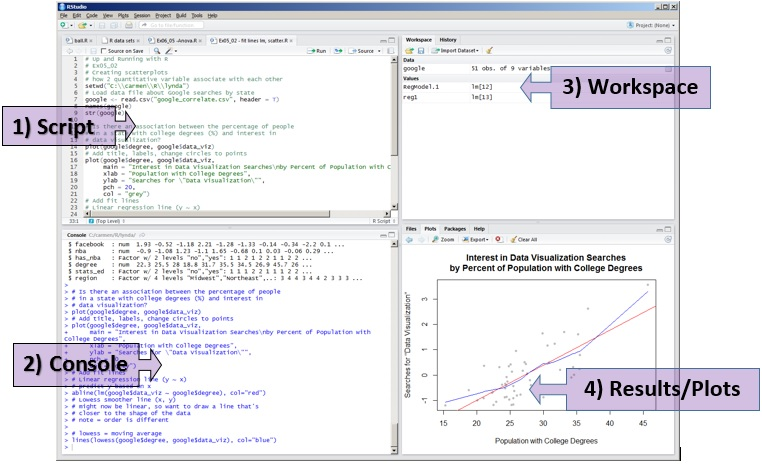

# Installing R and RStudio

Please install the latest version of *R* on your laptop (at the very least be sure the version is >3.2). In R, you can check the version with the command
```R
version
```


Although not strictly necessary, installing the latest version of *RStudio* is strongly recommended, and the workshops will be prepared assuming that you run R from RStudio.

If you experience difficulties with the installation(s), email me and I will do my best to assist.

## R

Go to [https://cran.curtin.edu.au/](https://cran.curtin.edu.au/)  or [https://cloud.r-project.org/](https://cloud.r-project.org/).
Click the download option appropriate for your operating system (Linux, Windows, OS X), then:

### OS X
Click on the file containing the latest version of R under "Files." Save the .pkg file, double-click it to open, and follow the installation instructions.

### Windows
Click on the "install R for the first time" link at the top of the page. Click "Download R for Windows" and save the executable file somewhere on your computer. Run the .exe file and follow the installation instructions.  

### Linux
You should already have R installed or you could install it with
```sh
sudo apt-get install r-base
```

Under Ubuntu >=16 that should be sufficient. For other distributions, you might want to add the CRAN to your sources.list to be sure you have the latest version. Google and DuckDuckGo are your friends.


## RStudio

Go to [https://www.rstudio.com/products/rstudio/download/](https://www.rstudio.com/products/rstudio/download/) and
select the *RStudio Desktop (FREE)* download and pick the appropriate installer (Windows, Mac, Ubuntu, Fedora ; 32/64-bit).

### OS X

Click on the version recommended for your system, or the latest Mac version, save the .dmg file on your computer, double-click it to open, and then drag and drop it to your applications folder.


### Windows

Click on the version recommended for your system, or the latest Windows version, and save the executable file.  Run the .exe file and follow the installation instructions.     

### Linux

Under linux, you may also be able to install RStudio with
```sh
sudo apt-get intall rstudio
```
# Using R from RStudio

By default, RStudio is organized in four panes (quadrants):

